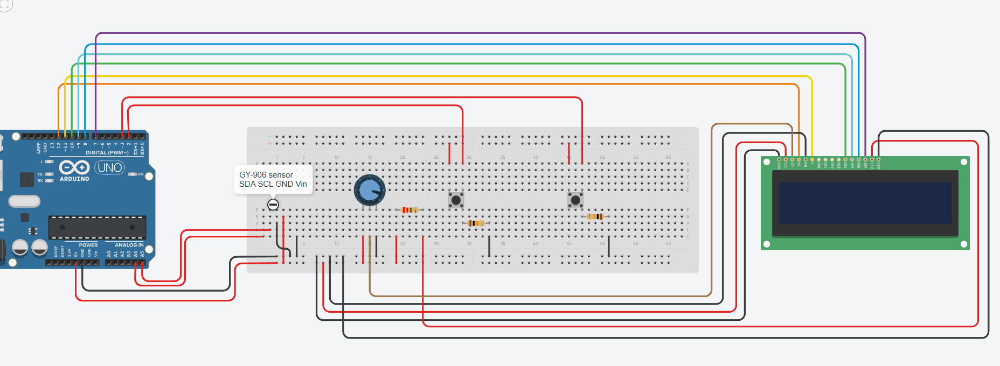

# Project idea
A flexible infrared termometer that sends data to a computer and writes data to a database

# Problem
When measuring temperature, sometimes I want to store that data on the computer somewhere on a database so I can perform some data analysis later.

# Used components
1. 1x Arduino Uno;
2. 1x Breadboard;
3. 28x Wires;
4. 1x Red button;
5. 1x Yellow button;
6. 1x Potentiometer;
7. 1x 220 ohm resistor;
8. 2x 10 kiloohm resistor;
9. 1x GY-906 infrared temperature sensor;
10. 1x LCD display;
11. 1x Personal computer
12. Arduino USB 2.0 cable type A/B

# Wiring photo

# Demo video

# Prerequisites
1. Have postgresql set up on your computer;
2. In the postgresql database have a database created called "arduino";
3. In arduino database have a created table called "temp" that has the following columns: id, time, temperature, calibration;
4. Hava Java version 17 or higher installed on your computer;

# Interrupts and timer config
I have 2 interrupts set up in this project:
1. Yellow button - when clicked calls an interrupt that changes the display mode (C or F) in the LCD. This mode is saved in EEPROM and is booted up first when the program starts.
2. Red button - when clicked calls an interrupt that increases the calibrationOffset value by 0.2 C. This value is then saved in EEPROM and is booted up when the program starts or resets. Also, the value is displayed on the LCD.

I also use a timer interrupt - every 2 seconds, I set a flag that when changed sends a signal to the DY-906 sensor to read temperature. Every time this value is read, temperature, mode and the offset are sent over Serial port to the pc.

# ISR roles
|            ISR name           |           Trigger         |            Role     |
|:------------------------------|:-------------------------:|--------------------:|
| ISR(Timer1) | 2 seconds pass | Ensures we only read sensor data every 2 seconds |
| ISR_button() | Yellow button clicked | Switches mode between C and F |
| ISR_button() | Red button clicked | Increases offset by 0.2 C |

# EEPROM layout
| Address range | Variable name | Data type and size | Description |
|:--------------|:-------------:|:------------------:|------------:|
| 0 | mode | byte (1 B) | Stores selected Mode - 0 for Celcius and 1 for Fahrenheit |
| 4-7 | calibrationOffset | float (4 B) | Stores user defined offset |
| 100 | EEPROM_MAGIC_VALUE | byte (1 B) | Used for EEPROM value validation |

# Timing budget
| Task | Trigger | Notes |
|:-----|:-------:|------:|
| Read temperature | Every 2 seconds | Uses I2C for communicating with the sensor |
| Serial output | Every 2 seconds | Send formatted data over Serial port (COM4 9600 baud) |
| Handle yellow button press | On demand | Updates the mode value and writes it into EEPROM |
| Handle red button press | On demand | Updates the calibrationOffset value and writes it into EEPROM |

# Current functionality
1. Wire the circuit following the wiring_photo.png provided in the directory;
2. Connect Arduino Uno to your computer;
3. Upload the provided code.cpp code into it;
4. Direct the GY-906 sensor to any object. You will notice that the temperature measured by the sensor is displayed on the LCD.
5. Press the yellow button. You will notice that temperature gets converted from Celcius into Fahrenheit. Also, this changed preference is saved in the EEPROM. This means that next time Arduino UNO is restarted, the configuration will load to display Fahrenheit value without needing to change it. Same logic applies changing Fahrenheit back to Celcius - the preference is always saved.
6. If you press the red button, calibrationOffset variable in the code gets increased by 0.2 C. This offset is displayed on the LCD after "calib: ". You will notice that the temperature gets increased as well. Every time it is increased, it is saved in EEPROM as the new offset. When the offset value reaches 5.0 it becomes 0.0 again - creating a loop. Indicating that the allowed offset is only between 0 and 5.
7. On our computer, we can run the provided Main.java code. It will read the values our Arduino device is passing over by Serial port and read it. Read data is parsed, double checked and then written into a postgresql database named "arduino". When you are satisfied, you stop the code execution.
8. You can login to the postgresql arduino database, open the temp table and run "SELECT * FROM temp". You will notice all the data was added the database. Also, for clarity, you can run "SELECT * FROM temp ORDER BY time" to get an ordered list so it's easier to check the data. 

# Future improvements
1. I could add another button to the circuit. The program would only send data through Serial when that button is clicked. That way I could have more control what kind of data I want to save in a database.
2. I could make the Java code more robust. Now it encounters some errors at the start every time the code is ran. I could make it so it ignores data until it starts getting good formatted data and only then enter a loop of saving data in a database.
3. In my database and java code I am only adding time after arduino was started. It would also be smart to add a real date and time to the table so I could run this code multiple times and compare data of different dates as well.

# Used articles and resources
1. Information about the GY-906 infrared temperature sensor and how to connect it - https://www.teachmemicro.com/arduino-interfacing-mlx90614-gy906-sensor/
2. Buttons and how to connect them - https://docs.arduino.cc/built-in-examples/digital/Button/
3. LCD and how to use it - https://docs.arduino.cc/learn/electronics/lcd-displays/
4. How to use Millis() - https://docs.arduino.cc/language-reference/en/functions/time/millis/
5. Information about the Wire.h library and I2C protocol - https://docs.arduino.cc/language-reference/en/functions/communication/wire/
6. Understanding I2C Protocol - https://docs.arduino.cc/learn/communication/wire/
7. Interrupts and how to use and attach them - https://docs.arduino.cc/language-reference/en/functions/external-interrupts/attachInterrupt/
8. Timer interrupts and how they work - https://docs.arduino.cc/libraries/timerinterrupt/
9. Learning PostgreSQL - https://www.postgresql.org/docs/current/
10. Ordering data in PostgreSQL - https://www.w3schools.com/postgresql/postgresql_orderby.php
11. Understanding I2C - https://www.youtube.com/watch?v=CAvawEcxoPU
12. Learning about the LiquidCrystal library - https://docs.arduino.cc/libraries/liquidcrystal/
13. Learning more about the EEPROM library - https://docs.arduino.cc/learn/built-in-libraries/eeprom/
14. Learning more about the TimerOne library - https://docs.arduino.cc/libraries/timerone/
15. Learning java Regular expressions (regex) - https://www.w3schools.com/java/java_regex.asp
16. Learning about the Java library for reading Serial Port - https://fazecast.github.io/jSerialComm/
17. Learning about how to connect Java to a database - https://docs.oracle.com/javase/8/docs/api/java/sql/Connection.html
18. Learning more about the Serial port and Arduino-Computer communication - https://docs.arduino.cc/language-reference/en/functions/communication/serial/