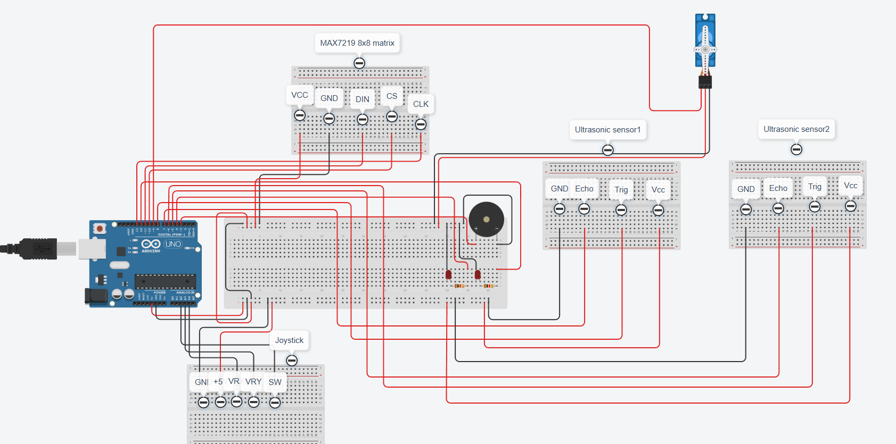

# Project idea
Police speed measuring device imitation that sends objects that exceed a speed limit to the database.

# Problem
There are plenty of speeding cars, cyclists and other vehicles. There needs to be a device that would measure their speed and fine them accordingly for speeding.

# Used components
1. 1x Arduino Uno;
2. 1x Breadboard;
3. 23x Wires;
4. 1x Piezo;
5. 2x LEDs;
6. 1x 8x8 led matrix;
7. 1x Servo motor;
8. 1x Joystick
9. 2x Ultrasonic sensors;
10. 2x 220 ohm resistors;
11. Personal computer;
12. Arduino USB 2.0 cable type A/B;

# Wiring photo

# Demon video
Demo video can be found in the same directory titled "demo.mp4";

# Prerequisites
1. Have postgresql set up on your computer;
2. In the postgresql database have a database created called "criminals";
3. In arduino database have a created table called "fines" that has the following columns: id, time, speedcmms, speedms, speedkmh;
4. Hava Java version 17 or higher installed on your computer;

# Current functionality
1. Wire the circuit following the wiring_photo.png provided in the directory;
2. Connect Arduino Uno to your computer;
3. Upload the provided code.cpp code into it;
4. You can use the joystick (Y axis) to turn the servo motor with the attached sensors left and right 45 degrees.
5. The sensors measure speed (only one way) of a passing object. As soon as the first sensor catches that a new object has appeared, it stops looking for more objects and starts a timer. As soon as the object gets detected by the second sensor, the timer stops and the speed is measured. After a small cooldown period, the sensors start looking for a new object.
6. When the speed is measured if it is less than 8, it is only displayed on the 8x8 led matrix display rounded down.
7. If the speed is equal or greater than 8, it triggers a piezo buzzer and 2 leds, displays the speed rounded down on the 8x8 led display and sends the speed over Serial to the computer.
8. On your computer, you can run the provided Main.java code. It will read values passed over Serial port. Read data is parsed, double checked and then written into a postgresql database named "criminals". You can stop the code execution at any time.

# Future improvements
1. I could not obtain the required infrared sensors for this project so I had to substiture them with the ultrasonic sensors. It would be nice to replace them sometime in the future. Because of this substitution, the sensors do not measure speed very accurately.
2. I could not obtain a required 6V battery to power a DC motor so I had to replace that with a piezo and some LEDs. Originally I had plans to connect a DC motor through an H-Bridge and have it raise a red flag when the speed limit is exceeded.
3. I am not great with arts and crafts, so my constructed platforms and glued modules are not perfect. It would be nice to upgrade how components are connected sometime in the future.

# Used articles and resources
1. Understanding the 8x8 LED matrix and how to control it - https://projecthub.arduino.cc/Dziubym/controlling-8x8-dot-matrix-with-max7219-and-arduino-0c417a
2. Understand the 8x8 LED control library - https://wayoda.github.io/LedControl/
3. Guide to micro servos - https://projecthub.arduino.cc/arduino_uno_guy/the-beginners-guide-to-micro-servos-ae2a30
4. Remembering how to connect buttons - https://docs.arduino.cc/built-in-examples/digital/Button/
5. Getting inspiration from the IR sensor project - https://projecthub.arduino.cc/yashastronomy/arduino-speed-detector-55410d
6. Understanding ultrasonic sensors - https://projecthub.arduino.cc/Isaac100/getting-started-with-the-hc-sr04-ultrasonic-sensor-7cabe1
7. Guide how to connect a joystick - https://projecthub.arduino.cc/hibit/using-joystick-module-with-arduino-0ffdd4
8. Calculating time between events - https://forum.arduino.cc/t/code-to-calculate-time-in-between-two-events/1006825
9. Remembering how to use postgresql - https://www.postgresql.org/docs/current/
10. Understanding how to create tables in postgresql - https://www.postgresql.org/docs/current/sql-createdatabase.html
11. Understanding datatypes in postgresql - https://www.geeksforgeeks.org/postgresql/postgresql-date-data-type/
12. Remmebering how to connect a piezo - https://projecthub.arduino.cc/SURYATEJA/use-a-buzzer-module-piezo-speaker-using-arduino-uno-cf4191