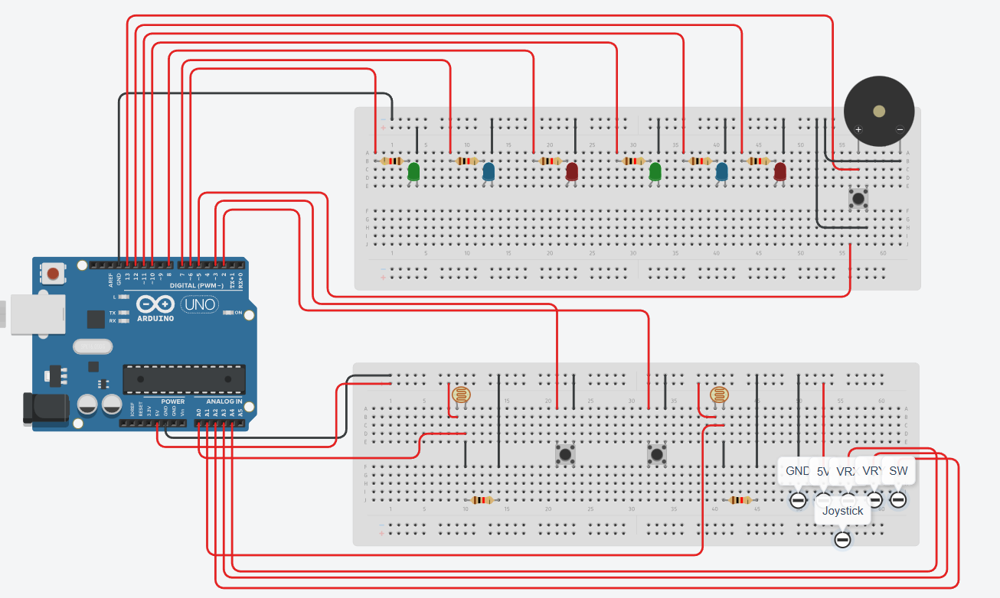
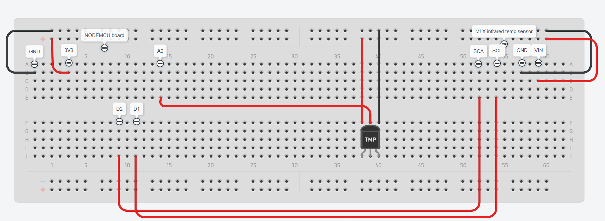
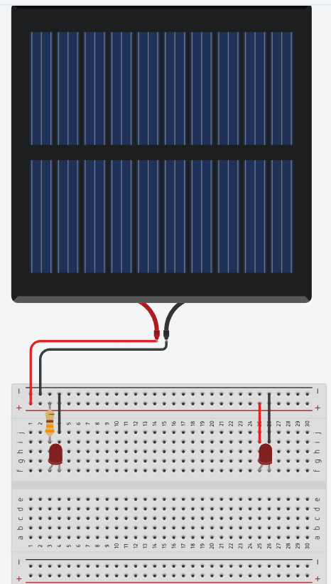

# Project idea
Create an imitation of a house powered by a solar panel and add some additional smart features to it.

# Problem
I need my solar panel to power the LEDs inside the house. I also need the solar panel to always face the direction that is most illuminated.

# Used components
1. 1x Arduino Uno;
2. 2x Large breadboard;
3. Wires;
4. 2x Red button;
5. 1x Yellow button;
6. 1x Joystick;
7. 2x Photoresistors;
8. 8x LEDs;
9. 2x 10 Kiloohm resistor;
10. 1x 330 Ohm resistor;
11. 6x 220 ohm resistor;
12. 1x LD35 temperature sensor;
13. 1x GY-906 infrared temperature sensor;
14. 1x 1x Piezo buzzer;
15. 1x NODEMCU V2 Wifi module;
16. 1x 1.2W / 9V solar panel (115x115x3mm);
17. 1x Personal computer;
18. Arduino USB 2.0 cable type A/B;
19. USB 2.0 to USB micro B type cable;
20. 1x Servo motor;

# Wiring photos
## Arduino


## NodeMCU


## Solar panel


# Demo video
Demo video can be found in the same directory titled "demo.mp4".

# Prerequisites
1. Have Java version 17 or higher setup on your personal computer;
2. Have Postgresql database installed on your device. Setup a database called "solar":
````
CREATE DATABASE SOLAR;
````

In this database create a table by running this code:
````
CREATE TABLE solar ( id SERIAL PRIMARY KEY, timestamp TIMESTAMP DEFAULT NOW(), mlx_temp DOUBLE PRECISION, lm35_temp DOUBLE PRECISION );
````
3. Setup the provided java project. In the main.java file update the database variables:
````
    private static final String DB_URL = "jdbc:postgresql://localhost:5432/solar";
    private static final String DB_USER = "postgres";
    private static final String DB_PASSWORD = "DATABASE_PASSWORD";
````
4. In the NodeMCU module code update the wifi parameters. *Note: It needs to be the same wifi your pc is connected to.
````
const char* ssid = "SSID";
const char* pass = "PASSWORD";
const char* host = "IP_ADDRESS";  
const int port = 5000;
````
5. Connect the Arduino and NodeMCU modules by cable to your pc and double check if your drivers are set up. If the NodeMCU module is not recognised, go to https://www.silabs.com/software-and-tools/usb-to-uart-bridge-vcp-drivers and set up the drivers.
6. Wire all the circuits accordingly to the provided wiring pictures.

# Interrupts
1. Yellow button – switches between AUTO and MANUAL modes. In AUTO mode, the solar panel will read values from both photoresistors and move the solar panel to the side that is producing more light. In MANUAL mode, the user is able to use the joystick and manually control the servo motor with the attached solar panel. Clicking the joystick button moves the servo to the middle.

2. Red button (the one connected to pin3 on Arduino board) – saves the current servo rotation value to Arduino EEPROM. On startup micro servo turns to the saved value.

# EEPROM values
| Address range | Variable name | Data type and size | Description |
|:-------------:|:-------------:|:------------------:|:-----------:|
| 1 | EEPROM_SERVO_ADDR | byte (1 B) | Stores a number for servo rotation |
| 0 | EEPROM_MAGIC_VALUE | byte (1 B) | Used for EEPROM value validation |

# Current functionality
1. Run the provided Java code (Main.java must run as a server). A graph window will open.
2. Connect Arduino Uno and NodeMCU boards to your computer;
3. NodeMCU will connect to your Wifi. It will also connect to the running Java program as a client.
4. Once connected, it will start reading the infrared and LD35 termometer values and sending them over the Wifi to your computer.
5. Sent values will be displayed on the Java terminal and also be drawn in the line graph. This way the user can see in real time how the values are changing.
6. Java code also connects to the "solar" database and is constantly saving all the temperature values in it.
7. Meanwhile, the Arduino circuit is managing the solar panel position. The user can use the joystick to control the solar panel position.
8. If the joystick button is clicked, the solar panel is moved to the middle position.
9. If a user clicks the red button, the curret solar panel position will be stored in EEPROM (Arduino memory) and loaded on Arduino startup. The solar panel will be moved to that position.
10. User can click the yellow button to enable AUTO mode. In this mode, all the user controls are disabled and the panel automatically moves to a position that is producing the most light.
11. Meanwhile, while both control boards are running, the solar panel is constantly producing energy and powering 2 LEDs.
12. At any given moment (unless user input is disabled) the user can click on another red button and enable CHRISTMAS mode. In this mode, Arduino sends impulses to 6 LEDs and a piezo buzzer to play a little christmas melody and flash some christmas lights.

# Future improvements
1. The solar panel is not producing enough energy to power even a single LED at the moment. Not sure if the solar panel is broken, but I will need to do some additional investigation in the future why it is not working.
2. Arduino is able to have only 2 interrupts. I would like to have more interrupts for more parallel functionalities in the future. Might look into additional modules that I could implement into the circuit.
3. The Micro Servo that I have is quite cheap and weak thus the movement of the solar panel is very jittery. I would need to buy a better Micro Servo or replace it with a DC motor (in that case I also need an external 6V battery).
4. The way my project is built is not very stable. It would be benefitial to build a more sturdy prototype out of metal in the future.
5. I would like to measure the voltage of my solar panel just to see how much energy it is producing. To achieve that I need to buy some extra modules that I would need to attach to my circuit.

# Used articles and resources
1. Information about the GY-906 infrared temperature sensor and how to connect it - https://www.teachmemicro.com/
2. Buttons and how to connect them - https://docs.arduino.cc/built-in-examples/digital/Button/
3. How to use Millis() - https://docs.arduino.cc/language-reference/en/functions/time/millis/
4. Information about the Wire.h library and I2C protocol - https://docs.arduino.cc/language-reference/en/functions/communication/wire/
5. Understanding I2C Protocol - https://docs.arduino.cc/learn/communication/wire/
6. Interrupts and how to use and attach them - https://docs.arduino.cc/language-reference/en/functions/external-interrupts/attachInterrupt/
7. Learning PostgreSQL - https://www.postgresql.org/docs/current/
8. Ordering data in PostgreSQL - https://www.w3schools.com/postgresql/postgresql_orderby.php
9. Understanding I2C - https://www.youtube.com/watch?v=CAvawEcxoPU
10. Learning more about the EEPROM library - https://docs.arduino.cc/learn/built-in-libraries/eeprom/
11. Learning java Regular expressions (regex) - https://www.w3schools.com/java/java_regex.asp
12. Learning about how to connect Java to a database - https://docs.oracle.com/javase/8/docs/api/java/sql/Connection.html
13. Guide to micro servos - https://projecthub.arduino.cc/arduino_uno_guy/the-beginners-guide-to-micro-servos-ae2a30
14. Guide how to connect a joystick - https://projecthub.arduino.cc/hibit/using-joystick-module-with-arduino-0ffdd4
15. Remmebering how to connect a piezo - https://projecthub.arduino.cc/SURYATEJA/use-a-buzzer-module-piezo-speaker-using-arduino-uno-cf4191
16. Setting up drivers for NODEMCU - https://www.silabs.com/software-and-tools/usb-to-uart-bridge-vcp-drivers
17. Connecting NODEMCU over wifi - https://www.youtube.com/watch?v=3XyaDyu8UDw
18. NODEMCU documentation - https://handsontec.com/dataspecs/module/esp8266-V13.pdf
19. Remembering how to connect LD35 - https://www.geeksforgeeks.org/electronics-engineering/arduino-temperature-sensor/
20. Research on how to draw graphs in Java - https://stackoverflow.com/questions/8693342/drawing-a-simple-line-graph-in-java
21. Drawing line graphs - https://www.geeksforgeeks.org/maths/line-graph/
22. Information about Java graphs - https://www.jfree.org/jfreechart/
23. Remembering socket programming in Java - https://www.geeksforgeeks.org/java/socket-programming-in-java/
24. Project idea - https://www.youtube.com/watch?v=nkPoRdrsRHE
25. Understanding how solar panels work - https://www.nationalgrid.com/stories/energy-explained/how-does-solar-power-work